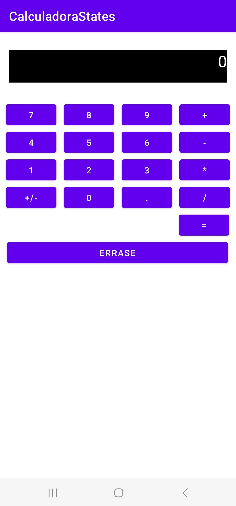
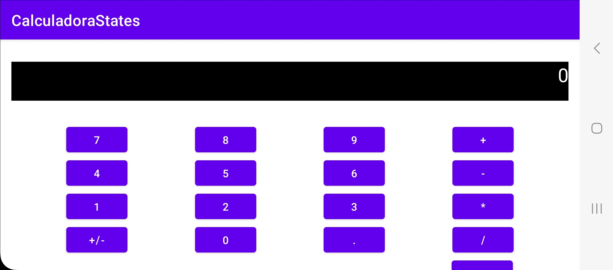

# calculadora_state_mobile_01
A calculator based on state machine in Android-Kotlin as part of my work as a instructor

## UML State Diagram

This is a screensho of the calculator

>

>

## Download
The calculator android apk.

For the APK due to the fact that mobile devices interact with sensitive apps, i suggest you build the APK and check your own build.

Its necessary an Android mobile Level 21 (LOLLIPOP, L) or above
